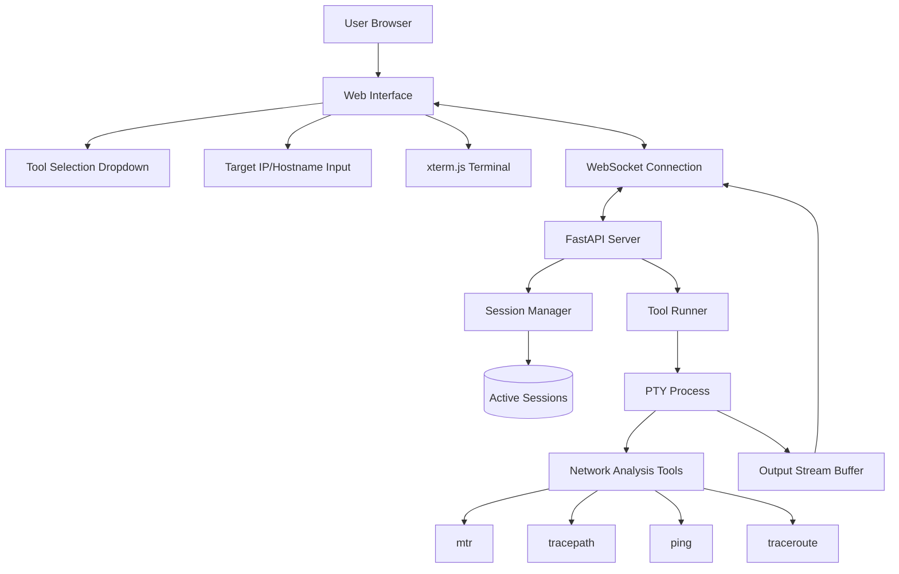

# Network Analysis Web Interface - Architecture Document

## Project Overview

A web-based interface that allows users to trigger network analysis tools on a server and view their real-time terminal output through a browser-based virtual terminal using xterm.js.

## Requirements Summary

### Functional Requirements
- Web interface for triggering network analysis tools
- Real-time streaming of terminal output to browser
- Support for tools: `mtr`, `tracepath`, `ping`, `traceroute`
- Dynamic, tool-specific configurable parameters
- Dropdown tool selection with target IP/hostname input
- Virtual terminal display using xterm.js
- Copy terminal output to clipboard functionality
- Output-only terminal (no user input to running tools)

### Technical Requirements
- Server-side execution of network analysis tools
- WebSocket-based real-time communication
- Full terminal emulation with curses support (for MTR interactive mode)
- ANSI color support
- Handle terminal control characters properly
- Pseudo-terminal (PTY) for tools to think they're in a real terminal
- Session lifecycle management with immediate cleanup on disconnect
- No persistent storage of output (real-time viewing only)
- Single port for both frontend and WebSocket communication
- No TLS/HTTPS (planned for later)

### Constraints
- Short sessions (1-5 minutes) for quick analysis
- Unlimited concurrent sessions per user initially
- Direct Linux server deployment
- No security restrictions (anyone with access can use)
- Small scale (handful of users)

## Technology Stack

### Backend
- **Framework**: Python with FastAPI
- **Environment**: Python virtual environment (venv)
- **Dependency Management**: pyproject.toml with clean dependency specification
- **WebSockets**: FastAPI's built-in WebSocket support
- **Process Management**: `ptyprocess` library for robust PTY handling
- **Terminal Handling**: `ptyprocess.PtyProcess.spawn()` for pseudo-terminal creation

### Frontend
- **Framework**: Vanilla JavaScript
- **Terminal Emulation**: xterm.js with full curses support
- **Communication**: WebSocket API
- **Clipboard**: `document.execCommand('copy')` (for non-HTTPS)

## System Architecture



## Component Design

### 1. Frontend Components

#### Web Interface (`index.html`)
- Clean UI with a two-column layout: main controls and terminal on the left, dynamic tool parameters on the right.
- Dropdown for tool selection (mtr, tracepath, ping, traceroute)
- Input field for target IP/hostname
- Dynamic parameter input fields based on selected tool
- Start/Stop buttons for tool execution
- Terminal container for xterm.js

#### Terminal Manager (`terminal.js`)
- xterm.js integration with full terminal emulation
- WebSocket client for real-time data streaming
- Terminal configuration for curses support
- Clipboard functionality implementation
- Connection state management

#### Tool Configuration (`tools.js`)
- Defines tool-specific configurations, including a `parameters` array for dynamic UI rendering.
- Parameter validation for target inputs
- Command construction logic

### 2. Backend Components

#### FastAPI Application (`main.py`)
- HTTP server for static file serving
- WebSocket endpoint for real-time communication
- CORS configuration for development
- Error handling and logging

#### Session Manager (`backend/mtronaut/session.py`)
- Track active user sessions
- Manage WebSocket connections
- Handle session cleanup on disconnect
- Process lifecycle management

#### Tool Runner (`backend/mtronaut/tools.py`)
- PTY-based process spawning
- Tool-specific command construction
- Real-time output streaming
- Process termination handling

#### Terminal Handler (`backend/mtronaut/terminal.py`)
- PTY creation and management
- Terminal control character processing
- ANSI escape sequence handling
- Output buffering and streaming

## Data Flow

### Tool Execution Flow
1. User selects tool and enters target from dropdown
2. Frontend validates input and sends WebSocket message
3. Backend creates new session and spawns PTY process
4. Tool starts execution in pseudo-terminal environment
5. Output streams through PTY to WebSocket
6. Frontend receives data and displays in xterm.js terminal
7. Real-time updates continue until tool completion or user disconnect

### Session Lifecycle
1. **Session Creation**: WebSocket connection established
2. **Tool Spawning**: PTY process created with selected tool
3. **Active Streaming**: Continuous output forwarding
4. **Cleanup Triggers**:
   - User closes browser/tab
   - WebSocket connection lost
   - Tool process completes
   - Manual stop request
5. **Immediate Cleanup**: Process termination and resource cleanup

## Technical Challenges & Solutions

### 1. Real-time Streaming
**Challenge**: Ensure no output stalling throughout the entire data flow
**Solution**: 
- Use PTY with non-blocking I/O
- Implement proper buffering strategy
- WebSocket with minimal latency configuration
- Avoid any synchronous operations in the streaming path

### 2. Terminal Control Characters
**Challenge**: Handle complex curses interfaces (especially MTR interactive mode)
**Solution**:
- Full PTY implementation for authentic terminal environment
- xterm.js with complete terminal emulation
- Proper ANSI escape sequence processing
- Terminal size negotiation between frontend and PTY

### 3. Process Management
**Challenge**: Clean lifecycle management and resource cleanup
**Solution**:
- Session tracking with WebSocket connection monitoring
- Immediate process termination on disconnect
- Proper signal handling (SIGTERM/SIGKILL)
- Resource cleanup on all exit paths

### 4. Multiple Concurrent Sessions
**Challenge**: Handle multiple users and sessions efficiently
**Solution**:
- Asynchronous FastAPI with proper concurrency handling
- Session isolation with unique identifiers
- Efficient WebSocket connection management
- Resource monitoring (future enhancement)

### 5. Proper Session Cleanup on Stop
**Challenge**: Ensure that when a session is stopped, the client receives a proper "stopped" message
**Solution**:
- Modified the `TerminalSession.stop()` method to explicitly call the `on_close` callback
- This ensures that session cleanup happens properly and the "stopped" message is sent to the client
- Fixes a race condition where the `on_close` callback wasn't being called when a session was stopped manually

## API Design

### WebSocket Protocol

This section defines the structure of messages exchanged between the client (frontend) and the server (backend) over the WebSocket connection.

#### Client-to-Server Messages

Messages sent from the client to the server are JSON objects with an `action` key that determines the message type.

##### `start_tool`
- **Action**: Initiates the execution of a network tool.
- **Payload**:
  - `tool` (string): The name of the tool to run (e.g., "mtr", "ping").
  - `target` (string): The hostname or IP address to target.
  - `term_cols` (integer): The number of columns in the client's terminal.
  - `term_rows` (integer): The number of rows in the client's terminal.
  - `params` (object, optional): A dictionary of tool-specific parameters. Keys are parameter names, values are their chosen settings.
- **Example**:
  ```json
  {
    "action": "start_tool",
    "tool": "mtr",
    "target": "8.8.8.8",
    "term_cols": 80,
    "term_rows": 24,
    "params": {
      "display_asn": true,
      "no_dns_resolution": false
    }
  }
  ```

##### `stop_tool`
- **Action**: Requests to terminate a running tool.
- **Payload**: None. The server will terminate the tool associated with the WebSocket connection.
- **Example**:
  ```json
  {
    "action": "stop_tool"
  }
  ```
  
##### `resize_terminal`
- **Action**: Notifies the server that the client's terminal size has changed.
- **Payload**:
  - `term_cols` (integer): The new number of columns.
  - `term_rows` (integer): The new number of rows.
- **Example**:
  ```json
  {
    "action": "resize_terminal",
    "term_cols": 120,
    "term_rows": 40
  }
  ```

#### Server-to-Client Messages

##### Raw Terminal Output
- **Description**: The primary data message. The server sends the raw, unprocessed byte stream from the PTY's output.
- **Format**: Binary WebSocket message (not JSON). This is the most efficient way to transmit the raw terminal data.

##### `status` (JSON)
- **Description**: Sends metadata or status updates about the process.
- **Format**: JSON object.
- **Payload**:
  - `status` (string): The current status (e.g., "starting", "running", "stopped", "error").
  - `message` (string, optional): A human-readable message.
- **Example**:
  ```json
  {
    "status": "error",
    "message": "Tool 'invalid_tool' not found."
  }
  ```

## Tool Configurations

## Tool Configurations

### MTR (My Traceroute)
```bash
mtr -b <target>
```
- Default interactive mode (not curses, not report)
- Shows both IP addresses and hostnames by default (`-b`)
- Real-time updates with simple terminal control
- Requires PTY for proper interactive behavior
- Configurable parameters:
    - `display_asn` (`-z`): Display Autonomous System (AS) number alongside each hop.

### Tracepath
```bash
tracepath <target>
```
- Simple text output
- Shows path MTU discovery
- Completes after reaching target
- Configurable parameters:
    - `maxHops` (`-m`): Maximum number of hops (TTL).
    - `no_dns_resolution` (`-n`): Do not resolve hostnames to IP addresses.

### Ping
```bash
ping <target>
```
- Real-time packet statistics
- ANSI color support for status
- Configurable parameters:
    - `count` (`-c`): Number of pings to send.
    - `packetSize` (`-s`): Size of packets in bytes.
    - `timestamp` (`-D`): Print timestamp before each line.

### Traceroute
```bash
traceroute <target>
```
- Hop-by-hop route discovery
- Text-based output
- Completes after reaching target
- Configurable parameters:
    - `count` (`-q`): Number of probe packets for each hop.
    - `maxHops` (`-m`): Maximum number of hops (TTL).
    - `icmp` (`-I`): Use ICMP ECHO for probes (default).
    - `no_dns_resolution` (`-n`): Do not resolve hostnames to IP addresses.

### Tracepath
```bash
tracepath <target>
```
- Simple text output
- Shows path MTU discovery
- Completes after reaching target

### Ping
```bash
ping -c 10 <target>
```
- Limited count for short sessions
- Real-time packet statistics
- ANSI color support for status

### Traceroute
```bash
traceroute <target>
```
- Hop-by-hop route discovery
- Text-based output
- Completes after reaching target

## Security Considerations

### Current Scope (No Security)
- No authentication or authorization
- No input validation beyond basic format checking
- No rate limiting or resource restrictions
- Direct command execution (controlled by predefined configurations)

### Future Security Enhancements
- User authentication and session management
- Input sanitization and validation
- Rate limiting and resource quotas
- Command injection prevention
- TLS/HTTPS implementation

## Deployment Architecture

### Server Requirements
- Linux server with network analysis tools installed
- Python 3.8+ with FastAPI and dependencies
- Network connectivity for tool execution
- Sufficient resources for concurrent sessions

### Installation Dependencies
```bash
# System packages
apt-get install mtr-tiny traceroute iputils-ping iputils-tracepath

# Python packages
pip install fastapi uvicorn websockets
```

### Directory Structure
```
mtronaut/
├── docs/
│   └── architecture.md
├── backend/
│   └── mtronaut/
│       ├── main.py
│       ├── session.py
│       ├── tools.py
│       └── terminal.py
├── frontend/
│   ├── index.html
│   ├── js/
│   │   ├── terminal.js
│   │   ├── tools.js
│   │   └── websocket.js
│   ├── css/
│   │   └── styles.css
│   └── lib/
│       └── xterm.js
├── pyproject.toml
└── README.md
```

## Performance Considerations

### Streaming Optimization
- Minimize buffering delays in PTY output
- Efficient WebSocket message handling
- Proper terminal size configuration
- Avoid blocking operations in async handlers

### Resource Management
- Monitor memory usage for long-running sessions
- Implement connection pooling for WebSockets
- Efficient process cleanup and resource deallocation
- Future: Add resource limits and monitoring

## Testing Strategy

### Unit Testing
- Tool configuration validation
- Session management logic
- WebSocket message handling
- Process lifecycle management

### Integration Testing
- End-to-end tool execution
- Real-time streaming performance
- Terminal emulation accuracy
- Connection handling and cleanup

### Manual Testing
- Each network tool with various targets
- MTR interactive mode functionality
- Multiple concurrent sessions
- Connection loss and recovery scenarios
- Clipboard functionality across browsers

## Future Enhancements

### Phase 2 Features
- Additional network analysis tools
- User authentication and sessions
- Output history and download capability
- Resource usage monitoring and limits
- TLS/HTTPS support
- Scheduled/automated tool execution
- Result comparison and analysis
- Multi-server deployment support
- Advanced security features

## Current Features

### Phase 1: Core Functionality
1. Basic FastAPI server with WebSocket support
2. PTY-based tool execution
3. Simple frontend with xterm.js integration
4. Support for ping and traceroute (simpler tools)

### Phase 2: Advanced Terminal Support
1. Full curses support for MTR interactive mode
2. ANSI color and control character handling
3. Session management and cleanup
4. Error handling and recovery
5. Tool parameter customization

### Phase 3: Polish and Enhancement
1. UI improvements and user experience
2. Clipboard functionality
3. Performance optimization
4. Documentation and deployment guides

This architecture provides a solid foundation for building a robust network analysis web interface that meets all the specified requirements while handling the complex challenges of real-time terminal streaming and curses interface support.